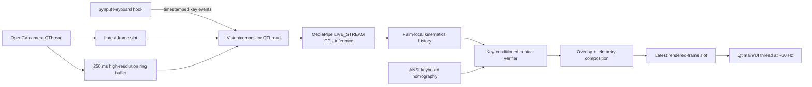

# Real-Time Touch-Typing Verifier

A native Windows desktop application that synchronizes global keyboard events with an overhead camera, tracks both hands with MediaPipe, and verifies which finger most likely contacted the key reported by Windows.

The current verifier is deterministic and user-independent. It does **not** train or load a personal machine-learning classifier. Instead, it combines a calibrated keyboard plane with key-conditioned fingertip trajectories.

## Quick start

### Requirements

- Windows 11
- An existing Anaconda installation with Python 3.11
- A webcam capable of viewing the keyboard, hands, and wrists
- PowerShell

### 1. Create the virtual environment

Open PowerShell in the repository and point `$AnacondaPython` at the Python executable in your Anaconda installation:

```powershell
Set-Location F:\github\typing-verifier

$AnacondaPython = "C:\ProgramData\anaconda3\python.exe"
# For a per-user installation, this may instead be:
# $AnacondaPython = "$env:USERPROFILE\anaconda3\python.exe"

& $AnacondaPython -m venv .venv
Set-ExecutionPolicy -Scope Process -ExecutionPolicy Bypass
.\.venv\Scripts\Activate.ps1

python -m pip install --upgrade pip
python -m pip install -r .\requirements.txt
```

Do not install another copy of Python with `winget`; the environment is created from the existing Anaconda interpreter.

### 2. Download the hand-landmark model

```powershell
python .\fetch_model.py
```

This downloads the official MediaPipe `hand_landmarker.task` file, verifies its size and SHA-256 hash, and stores it under `models\`. The desktop application also performs this check automatically at startup.

### 3. Run the desktop application

```powershell
python .\ui_app.py `
  --processing-height 720 `
  --inference-fps 30
```

The default camera backend is Windows Media Foundation (`MSMF`). The last successfully opened camera, backend, resolution, FPS, keyboard ROI, keyboard anchors, and zoom setting are restored from `app_config.json`.

## First-time setup in the application

### Camera

1. Select the camera device.
2. Keep **Media Foundation (MSMF)** unless the device only works with DirectShow.
3. Choose 1920×1080 or 1280×720 and the desired capture FPS.
4. Click **Apply camera settings**.

For best results, mount the camera above the keyboard with both hands and wrists visible. Use even lighting and avoid strong reflections from glossy keycaps.

### Calibrate the keyboard plane

Click **Calibrate Keyboard Plane (4 points)**, then use the mouse on the live video to click the center of these physical keys in order:

1. Backtick: `` ` ``
2. Backspace
3. Right Ctrl
4. Left Ctrl

Click the physical keys regardless of how the camera image is rotated or mirrored. Do not press the keys during this procedure.

The four anchors define a perspective transform for the US ANSI key grid. Calibration can be performed in the normal or digitally zoomed view; zoomed click coordinates are automatically converted back to full-camera coordinates.

After the fourth click, the projected key outlines should align with the physical keycaps. Calibration is saved automatically.

### Keyboard ROI and digital zoom

Keyboard-plane calibration automatically derives a padded ROI that includes the keyboard, palms, and wrists. Use **Set Keyboard ROI** only when a manual crop is needed.

Enable **Digital Zoom to ROI** to crop the source frame before inference. The crop is resized to the configured processing height, and all MediaPipe coordinates are unprojected into full-frame coordinates before geometry or contact scoring.

## Reading the results

The keystroke table contains:

- **Timestamp:** wall-clock time derived from the monotonic key event timestamp.
- **Key:** the key reported by the global Windows keyboard hook.
- **Expected finger:** the US ANSI touch-typing assignment.
- **Observed finger:** the finger selected by contact verification.
- **Confidence:** the contact score, not an ML probability.

Modifier keys such as Shift, Ctrl, Alt, and the Windows/Cmd key are recorded as modifiers and are not treated as tap-contact events.

An `Unknown` result includes a diagnostic reason, such as:

- `Keyboard Plane Not Calibrated`
- `No Hand Landmarks in Window`
- `Insufficient Trajectory`
- `Incomplete Frame Window`
- `Weak Contact`
- `Ambiguous Contact`
- `Unmapped Key`

Hover over the observed-finger or confidence cell for decision details.

## Command-line options

```text
--model PATH               MediaPipe hand_landmarker.task path
--processing-height INT    Inference/display target height; default 720
--inference-fps FLOAT      Maximum MediaPipe submission rate; default 30
--app-config PATH          Settings file; default app_config.json
```

Example using a different model location:

```powershell
python .\ui_app.py `
  --model D:\models\hand_landmarker.task `
  --processing-height 720 `
  --inference-fps 24
```

## Technology stack

| Component | Technology | Purpose |
|---|---|---|
| Desktop UI | PySide6 / Qt 6 | Native Windows window, controls, telemetry cards, table, calibration interaction |
| Camera | OpenCV | MSMF/DirectShow capture, MJPG negotiation, resizing, overlays, perspective transforms |
| Hand tracking | MediaPipe Tasks Hand Landmarker | Asynchronous 2D image and 3D world landmarks for up to two hands |
| Keyboard hook | pynput | Global press/release events independent of Qt keyboard focus |
| Numerical processing | NumPy | Coordinate transforms, velocities, filters, scoring, and vector geometry |
| Timing | `time.perf_counter_ns()` | Monotonic nanosecond timestamps shared by camera and keyboard events |
| Configuration | JSON | Persistent local camera, ROI, plane-anchor, and zoom settings |

The pinned runtime dependencies are listed in `requirements.txt`. No scikit-learn runtime or trained finger model is required.

## Runtime architecture



### Thread ownership

The Qt main thread only handles widget events, paints the newest composited frame, and updates dashboard values. Blocking camera reads, keyboard hooks, and vision processing never run on the UI thread.

The background components are:

1. **Camera QThread** — owns camera negotiation and publishes timestamped frames.
2. **Timed camera reader** — isolates a driver-level blocking `cap.read()` behind a bounded mailbox and timeout.
3. **Keyboard QThread** — owns the `pynput` listener and a bounded event queue.
4. **Vision/compositor QThread** — submits frames to MediaPipe, resolves pending key events, draws overlays, and publishes the newest rendered frame.
5. **MediaPipe callback** — receives asynchronous LIVE_STREAM results and updates the thread-safe kinematic history.

### Latest-value handoffs

Camera and rendered frames use single-value slots. Publishing a newer frame replaces an unconsumed older frame and increments the drop count. This applies backpressure by dropping stale video instead of allowing latency to grow.

The UI refresh timer runs every 16 ms. It paints whatever composited frame is newest, so rendering can recover immediately after a temporary slowdown.

## Camera acquisition and recovery

Camera initialization uses the following Windows-specific order:

1. Open the selected device with MSMF or DirectShow.
2. Set `CAP_PROP_FOURCC` to MJPG.
3. Set `CAP_PROP_BUFFERSIZE` to 1.
4. Set width, height, and FPS.

The reader waits at most 100 ms for each result. After 30 consecutive failures or timeouts, the worker reports a camera error, releases the current backend, and tries the fallback backend. MSMF is the default because it avoids cold-start freezes seen with some DirectShow drivers.

## Keyboard-plane geometry

The program models the main US ANSI block in a 15×5 unit coordinate system. Each key has a polygon expressed in keyboard-plane units, including variable-width keys such as Backspace, Shift, Enter, and Space.

The four calibration clicks correspond to the centers of `` ` ``, Backspace, right Ctrl, and left Ctrl. OpenCV computes a 3×3 perspective homography from those canonical points to their normalized camera coordinates:

```text
camera_point ~ H × keyboard_plane_point
```

Every ANSI key polygon is projected through the same matrix. Because the anchors have semantic identities rather than screen-corner identities, the transform supports rotated, oblique, and mirrored camera views.

The keyboard ROI is derived by projecting an extended plane beyond the keyboard edges and especially beyond the spacebar. This retains the palms and wrists that MediaPipe needs for reliable tracking.

## Hand landmarks and kinematics

MediaPipe Hand Landmarker runs in `LIVE_STREAM` mode with the CPU delegate and up to two hands. The inference submission rate is independent of the camera and UI rates; a typical configuration captures and renders at 60 FPS while MediaPipe runs near 24–30 FPS.

For each detected hand, the kinematic engine:

1. Unprojects zoomed image landmarks into full-frame normalized coordinates.
2. Builds a palm-local 3D basis from the wrist and MCP joints.
3. Normalizes coordinates by palm width.
4. Applies vectorized One Euro filters to image, world, and palm-local landmarks.
5. Computes fingertip image/local velocity and PIP/DIP flexion rates.
6. Retains a 250 ms landmark history for key-aligned analysis.

Palm-local normalization reduces sensitivity to hand size, camera distance, and ROI scale. The One Euro filter suppresses stationary jitter while increasing responsiveness during fast finger motion.

## Key-event synchronization

Camera frames and global keyboard events are timestamped with `time.perf_counter_ns()`, avoiding wall-clock adjustments.

At keydown:

1. The OS-provided key identifies the single target key polygon.
2. The current pre-key frames are retained from the high-resolution ring buffer.
3. The event remains pending until post-key frames and MediaPipe results are available.
4. The verifier analyzes approximately `-150 ms` through `+50 ms` relative to keydown.
5. Wall-clock time is added only for display in the log table.

This is key-conditioned verification: the system already knows *which key* was pressed and only needs to determine *which fingertip trajectory best explains that contact*.

## Contact scoring

For every visible fingertip, the verifier computes three signals against the target key polygon:

- **Spatial proximity:** pixel distance from the fingertip to the projected polygon, normalized by that key's diagonal.
- **Downward stroke:** palm-local downward displacement and peak downward velocity before contact.
- **Velocity reversal:** downward approach followed by upward release near the keydown time.

The proximity score is exponential, reaching 1.0 inside the polygon and decaying with distance. Motion evidence is spatially gated so a strong movement far from the target key cannot win.

The final score is:

```text
gate  = 0.20 + 0.80 × proximity
score = 0.55 × proximity + gate × (0.30 × stroke + 0.15 × reversal)
```

The best candidate must score at least 0.42. A result below 0.65 is also rejected when its margin over the runner-up is less than 0.035. These guardrails favor `Unknown` over an unjustified finger assignment.

## Posture monitoring

The posture monitor uses the palm normal as a wrist/palm orientation proxy; MediaPipe does not observe the forearm directly.

- The neutral baseline is learned over the first 1.5 seconds of stable tracking.
- A warning requires at least 25° deviation for 0.6 seconds.
- The warning clears only after returning below 15° for 0.8 seconds.

This hysteresis prevents the banner from flickering around a threshold.

## Project files

| File | Responsibility |
|---|---|
| `ui_app.py` | PySide6 application, live video widget, controls, telemetry, calibration UI |
| `ui_workers.py` | Camera, keyboard, frame-ring, and vision worker threads |
| `kinematics.py` | MediaPipe LIVE_STREAM wrapper, filtering, hand analysis, contact scoring, overlays |
| `keyboard_geometry.py` | ANSI key polygons, four-anchor homography, projection, ROI derivation |
| `keyboard_layouts.py` | US ANSI expected-finger mapping and key-label normalization |
| `posture.py` | Palm-angle posture monitor with hysteresis |
| `mvp_sync.py` | Standalone synchronization/camera diagnostic and shared capture primitives |
| `phase2_app.py` | Lightweight OpenCV/MediaPipe diagnostic preview without the Qt shell |
| `fetch_model.py` | Official MediaPipe model download and integrity verification |
| `qt_bootstrap.py` | Qt runtime-path preparation for the Anaconda/venv environment |

## Diagnostic commands

Test camera and keyboard synchronization without MediaPipe or Qt:

```powershell
python .\mvp_sync.py --camera-idx 0 --backend auto --width 1920 --height 1080 --fps 60
```

Test MediaPipe and hand overlays without the PySide6 shell:

```powershell
python .\phase2_app.py `
  --camera-idx 0 `
  --backend auto `
  --width 1920 `
  --height 1080 `
  --fps 60 `
  --processing-height 720 `
  --inference-fps 30
```

## Troubleshooting

### Camera LED is on but no frame appears

- Start with MSMF.
- Apply 1280×720 at 30 FPS to rule out an unsupported camera mode.
- Close applications that may hold the camera exclusively.
- Try DirectShow from the sidebar; the app also falls back automatically after repeated timeouts.

### Key polygons do not align

- Recalibrate using the **center** of the four requested physical keys.
- Follow the semantic order exactly, even if the keyboard appears upside down.
- Ensure the camera and keyboard do not move after calibration.
- US ANSI geometry will not exactly fit a non-ANSI or compact keyboard.

### No hand landmarks appear

- Ensure complete palms and wrists are inside the crop, not only fingertips.
- Enable digital zoom after the keyboard plane is calibrated.
- Improve lighting and reduce motion blur.
- Lower capture FPS if the camera increases exposure time at 60 FPS.

### Frequent weak or ambiguous contact results

- Verify that projected key polygons align precisely.
- Use a more overhead camera angle to reduce fingertip occlusion.
- Increase MediaPipe inference FPS if the CPU has available capacity.
- Keep both hands visible throughout the `-150 ms` to `+50 ms` key window.

## Local data and privacy

Video frames, landmarks, key events, and verification results remain local to the application. The only network operation is downloading the official MediaPipe model when it is missing or fails integrity verification. Camera settings and calibration geometry are stored locally in `app_config.json`, which is excluded from Git.

## License

See [LICENSE](LICENSE).
